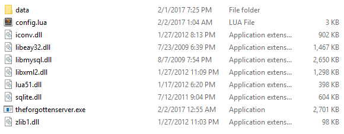

# Setting up your first server

When setting up your first server, things may seem quite tedious to look at, but it will certainly get easier as we go.

**Installing a text editor**

When editing code, programmers tend to use certain text editors that have colors, features, and design that they like. The most popular text editors are [Notepad++](https://notepad-plus-plus.org/download) \(free\) and [Sublime Text](https://www.sublimetext.com/3)\(free trial\). Install whichever one appeals to you more, we will be using a text editor later on.

**Database**

Open Tibia servers store information such as accounts, players, house items and many more things in a database. A database is a separate service and not part of the Open Tibia server itself, but is being used by it. This means you need to install a database service to run alongside the Open Tibia server. In this tutorial we will be using [Uniform Server Zero](http://www.uniformserver.com/), a web server which includes a database service \(MySQL\) and also a web based database management tool called phpMyAdmin, where you will be able to view and modify data such as player names, levels or other stored information.

After downloading Uniform Server, open "unicontroller.exe" and click the two buttons at the top right \(Start Apache, Start MySQL\). You will see two windows pop up in your default browser, close them. Click back on the unicontroller and click the button that says "phpMyAdmin". There will be another window now that should pop up in your default browser, keep this open.

The screen you're looking at will be a bit confusing due to all of the buttons, but we only need a few to set up our database. Follow these steps:

1. On the left sidebar, click "New"
2. Select your database name and click "Create"
3. You should have that database created now, and should have automatically opened it for you
4. At the top, click the button that says "Import"
5. Click "Choose File" next to "Browse your computer" and locate the "schema.sql" file you extracted and select it
6. Scroll down and click "Go"

Now we have a database that our server will be able to store information in, keep this window up, we will need it again soon.

**Server files**

You will need a set of files to start off with so you can run your server, you can download the files [here](https://github.com/otland/forgottenserver/releases/tag/v1.2), after downloading, extract the zip. There is also another set of files required to run the server engine, which you can find [here](https://otland.net/threads/opentibia-dll-pack-v2-0.155310/), download whatever bit your machine is and extract it to the same folder you have everything in.

The folder should look like this now:

Open config.lua and follow these steps:

1. Locate mysqlUser and change the value to "root", if it isn't already
2. Locate mysqlPass and change the value to "" or the password you selected, if it isn't already
3. Locate mysqlDatabase and change the value to what database name you chose in the previous section

Once done, save and close the file.

Now, open theforgottenserver.exe, your server should start up now!

**Website \(Znote AAC\)**

To create an account on your new server, we will need to set up a website. We will be using Znote AAC for this tutorial, which you can get [here](https://github.com/znote/znoteaac).

1. Extract the .zip file to your web directory \(Example: C:\UniServ\www \) Without modifying config.php, enter the website and wait for mysql connection error. This will show you the rest of the instructions as well as the mysql schema.
   1. Edit config.php and:
2. modify `$config['TFSVersion']` with correct TFS version you are running. \(TFS\_02, TFS\_03, TFS\_10\).
3. modify `$config['page_admin_access']` with your admin account username\(s\).
   1. Before inserting correct SQL connection details, visit the website \(\[[http://127.0.0.1/\]\(](http://127.0.0.1/]%28)[http://127.0.0.1/%29\](http://127.0.0.1/%29%5C)\), it will generate a mysql schema you should import to your OT servers database.
   2. Follow the steps on the website and import the SQL schema for Znote AAC, and edit config.php with correct mysql details.

You should now be able to connect to your website by typing to 127.0.0.1 or localhost in your address bar.

**Website alternative \(Gesior AAC\)**

1. Download Gesior 2012 from github: [https://github.com/gesior/Gesior2012/archive/TFS-1.0.zip](https://github.com/gesior/Gesior2012/archive/TFS-1.0.zip)
2. Extract the .zip file to your web directory \(Example: C:\UniServ\www \) Without modifying config.php, enter the website and follow the installation, during the installation Gesior will install the database schema needed.

You should now be able to connect to your website by typing \(127.0.0.1, localhost or the IP\) in your address bar on your browser.

